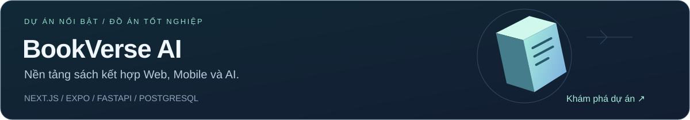

# Xin chào, mình là Quốc Tuấn

Mình học **Hệ thống thông tin**, định hướng **Web & Mobile Developer**. Mình xây dựng giao diện với React/Next.js, ứng dụng di động với React Native/Expo và xử lý API, dữ liệu bằng TypeScript, Python và PostgreSQL.

Mình quan tâm đến cách một tính năng đi từ giao diện đến backend: dễ sử dụng, phân quyền đúng và có kiểm thử. Ngoài lập trình, mình thích âm nhạc.

**[Xem BookVerse AI](https://github.com/quoctuan364/bookverse-ai)** · **[Các repository của mình](https://github.com/quoctuan364?tab=repositories)**

## Công nghệ mình đang sử dụng

| Mảng | Công nghệ trong dự án |
| :--- | :--- |
| **Frontend** | React · Next.js · TypeScript · Tailwind CSS |
| **Mobile** | React Native · Expo |
| **Backend & dữ liệu** | Next.js Server Actions/API · FastAPI · PostgreSQL · Prisma |
| **AI ứng dụng** | Gợi ý sách · RAG · pandas · scikit-learn |
| **Kiểm thử & công cụ** | Git · Docker · Playwright · pytest · Node.js test runner |

## Dự án nổi bật

**BookVerse AI** kết hợp khám phá sách, đọc Ebook, hội viên, chợ sách và trợ lý AI trong một hệ thống.

- **Web:** catalog/tìm kiếm, trình đọc, giỏ hàng, quản lý hội viên và giao diện quản trị theo vai trò.
- **Mobile:** ứng dụng Expo kết nối API cho catalog, đọc thử và các tính năng demo.
- **Backend & AI:** PostgreSQL/Prisma, dịch vụ gợi ý FastAPI, chatbot RAG, kiểm soát quyền truy cập và fallback.
- **Kiểm chứng:** bộ unit test TypeScript đạt **272/272** trên workspace nguồn ngày **08/09/2026**; hướng dẫn chạy và giới hạn kiểm chứng được ghi trong repository.

> Đây là đồ án: thanh toán là Sandbox; đăng nhập/thanh toán mobile còn mô phỏng. Dữ liệu demo không phải hành vi người dùng thật. Chưa có bằng chứng Hybrid vượt baseline.

**[Mã nguồn](https://github.com/quoctuan364/bookverse-ai)** · **[Kiến trúc](https://github.com/quoctuan364/bookverse-ai/blob/main/docs/DEFENSE_ARCHITECTURE.md)** · **[Chạy demo](https://github.com/quoctuan364/bookverse-ai/blob/main/docs/INSTALL_CLEAN_MACHINE.md)** · **[Báo cáo & phạm vi](https://github.com/quoctuan364/bookverse-ai/blob/main/docs/BAN_DANG_GITHUB.md)**

## Các dự án khác

| Dự án | Chủ đề |
| :--- | :--- |
| [Customer Segmentation](https://github.com/quoctuan364/customer-segmentation-kmeans-streamlit) | Phân cụm khách hàng với K-Means, Hierarchical Clustering và Streamlit. |
| [Diabetes Prediction](https://github.com/quoctuan364/diabetes-prediction-streamlit) | Dự án học tập về machine learning và ứng dụng Streamlit. |

## Kết nối

Mình muốn phát triển theo hướng **Web & Mobile**, làm cả giao diện và backend. Bạn có thể xem mã nguồn và cách chạy từng dự án ở các liên kết bên trên.

[Email](mailto:Tuanisme362004@gmail.com) · [GitHub](https://github.com/quoctuan364) · [Facebook](https://www.facebook.com/liltuan364) · [Instagram](https://www.instagram.com/lnqtuan/)
